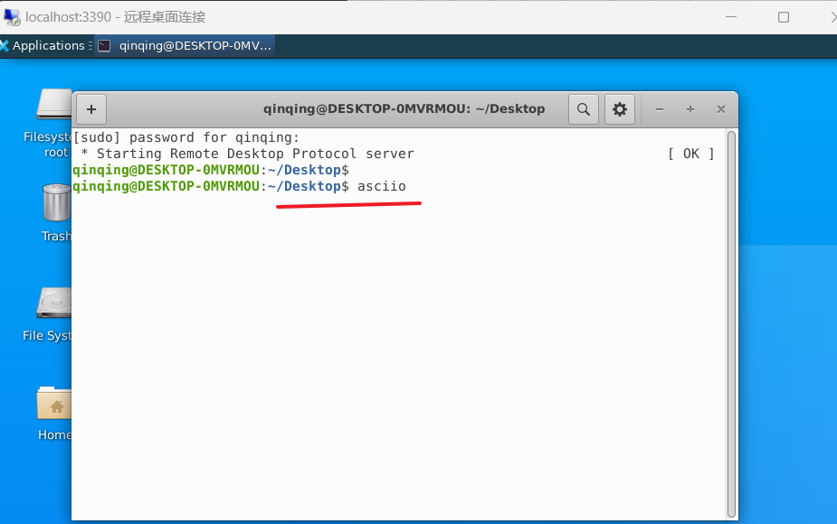
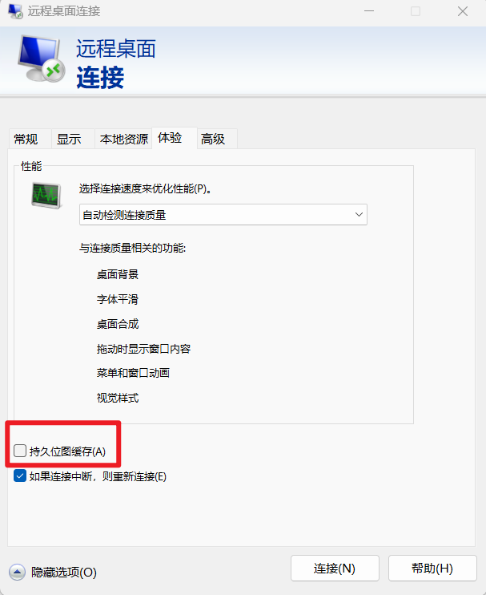

# linux_app_use_in_windows

## 1 WSL Install

### 1.1 Preparations before installation

Enable the wsl function and configure the default wsl to wsl2.

```txt
wsl --install
dism.exe /online /enable-feature /featurename:Microsoft-Windows-Subsystem-Linux /all /norestart
dism.exe /online /enable-feature /featurename:VirtualMachinePlatform /all /norestart
wsl --set-default-version 2

```
Then reboot the computer.

>Note: This operation only needs to be done once.

### 1.2 Download the wsl installation package

>In fact, it doesn’t have to be so troublesome. There is a standard method for installing wsl on Microsoft’s official website.
>I am demonstrating here just to avoid installing to the C drive.

Download the [ubuntu image](https://wsldownload.azureedge.net/Ubuntu_2004.2020.424.0_x64.appx) file through your download tool

## 2 Create a directory on the non-C drive to place the package you just downloaded

And rename the package you just downloaded to Ubuntu.zip

```txt
E:\wsl
 └──Ubuntu.zip
```
### 2.1 Unzip the installation package and execute ubuntu2004.exe in the package.

```txt
PS E:\wsl\ubuntu> .\ubuntu2004.exe
```
This step takes a little longer. You will then be asked to set a new username and password. Note: The root username cannot be used.Please remember the username and password you set.

## 3 Settings for ubuntu in wsl

### 3.1 Update packages in environment

```bash
 # Update the list of all packages
sudo apt update
 # Update all packages
sudo apt upgrade
```
If you are asked to enter a password during execution, just enter the password we set earlier.

### 3.2 Compilation and build tool installation

When you first enter the OS, you may be missing many essential tools. Compilation and build tools need to be installed.

```bash
sudo apt install build-essential
```
This command will install a series of software packages, including: gcc, g++, make, etc., as well as the dependencies they depend on.

### 3.3 Install gtk3 execution environment

```bash
sudo apt-get install libgtk-3-dev
sudo apt install libgtk3-perl
```

### 3.4 Install your own GUI applications and their dependencies

Here is an example of [asciio](https://github.com/nkh/P5-App-Asciio)

```bash
sudo apt install unzip
sudo apt install libeval-context-perl 
sudo apt install libdirectory-scratch-structured-perl 
sudo apt install libfile-homedir-perl
sudo apt install libterm-size-any-perl
sudo apt install libio-prompter-perl
sudo apt install libterm-termkey-perl

sudo apt-get install libmodule-build-perl

sudo apt install perl cpanminus
sudo cpanm Pango
sudo cpanm Hash::Slice


git clone https://github.com/nkh/P5-Data-TreeDumper-Renderer-GTK
cd P5-Data-TreeDumper-Renderer-GTK
sudo perl Makefile.pl
sudo make
sudo make install

git clone https://github.com/nkh/P5-App-Asciio
cd P5-App-Asciio
sudo perl Build.PL
sudo ./Build installdeps 
sudo ./Build install
```

>Note: This is just an example. For the latest installation method of the software, please refer to the official documentation.
>Note: If there is no git in your wsl, you can also copy the files to be installed through windows.

### 3.5 Install a desktop environment for executing GUI programs

```bash
sudo apt install ubuntu-desktop
```
This will install the GNOME desktop environment. This installation package is very large, about 2G. So your waiting time may be longer.

### 3.6 Install your language pack

I use Chinese as an example here

```bash
sudo apt-get install language-pack-zh-hans
```
### 3.7 Install xrdp remote desktop software

```bash
sudo apt update
sudo apt install -y xfce4 xrdp
```

### 3.8 Modify the xrdp default port

>Since the default configuration of xrdp after installation is the same port 3389 as the Windows Remote Desktop, in order to prevent conflicts with the Windows Remote Desktop, it is recommended to change it to another port.

```bash
sudo sed -i 's/3389/3390/g' /etc/xrdp/xrdp.ini
```
### 3.9 Specify the login session type for the current user

>It is important to note this step. If not set, it will cause the remote desktop connection to crash later.

```bash
echo xfce4-session > ~/.xsession
```

### 3.10 Start xrdp

```bash
sudo /etc/init.d/xrdp start
```

It is recommended to add this sentence to our `.bashrc` so that the remote desktop function is only turned on every time the system starts.


## 4 Remote login method on windows side

(1). Run the `mstsc` command to open a remote desktop connection in Windows systems

(2). Enter `localhost:3390` for the address (note that the port number here should be consistent with the modified configuration above)


(3). Configure the resolution you want to enter, it is recommended to set it to full screen

Click here first


Then set the resolution


>Drag the horizontal scroll bar to the far right to make it full screen

(4). Enter the account password used in WSL.


## 5 Install other necessary programs

### 5.1 Install non-English input methods

>Take installing the Chinese input method as an example

#### 5.1.1 Install input method

First, you need to install the fcitx input method and related Chinese input method packages in Ubuntu

```bash
sudo apt install dbus-x11 im-config fonts-noto fcitx fcitx-pinyin fcitx-sunpinyin fcitx-googlepinyin
```

#### 5.1.2 Set up automatic startup

```bash
fcitx-autostart
```

#### 5.1.3 Configure environment variables

Next, you need to add some environment variables in the `~/.profile` file

```bash
echo 'export LANG=zh_CN.UTF-8' >> ~/.profile
echo 'export INPUT_METHOD=fcitx' >> ~/.profile
echo 'export XMODIFIERS=@im=fcitx' >> ~/.profile
echo 'export GTK_IM_MODULE=fcitx' >> ~/.profile
```

#### 5.1.4 Restart WSL

Finally, you need to restart WSL for these changes to take effect

```bash
wsl --shutdown
```

#### 5.1.5 Re-enter WSL and add input method from desktop


#### 5.1.6 Choose the input method you want


## 6 Run GUI program in remote desktop




## 7 Some common problems solved

### 7.1 After a period of inactivity during remote connection, the screen goes black and cannot be entered.

presistent bitmap cache this option cannot be selected




